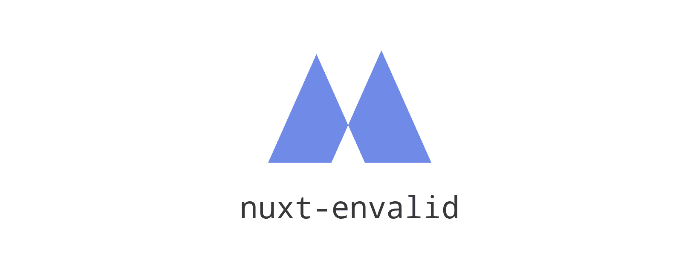

# Introduction
{: .fs-9 }

Dead simple [Envalid](https://github.com/af/envalid) integration for [Nuxt 2](https://nuxtjs.org).
{: .fs-6 .fw-300 }

[Get started now]({{ site.baseurl }}){: .btn .btn-primary .fs-5 .mb-4 .mb-md-0 .mr-2 } [View on GitHub](https://github.com/manuelhenke/nuxt-envalid){: .btn .fs-5 .mb-4 .mb-md-0 }

---

## Features

- Define a required schema for your environment variables
- Validates variables in the `env` property of the `nuxt.config.js`
- Validates variables in `process.env`
- Validates variables present in the `.env` file, if loaded together with [@nuxtjs/dotenv](https://github.com/nuxt-community/dotenv-module)
- Fails the build process if a variable is missing
- Loads them cleaned and enriched with default values into your application context (`process.env` and `context.env`)

---

## About the project

nuxt-envalid is &copy; {{ "now" | date: "%Y" }} by [Manuel Henke](http://henkebyte.com).

### License

Distributed by an [MIT license](https://github.com/manuelhenke/nuxt-envalid/tree/main/LICENSE.txt).

### Contributing

When contributing to this repository, please first discuss the change you wish to make via issue,
email, or any other method with the owners of this repository before making a change. Read more about becoming a contributor in [our GitHub repo](https://github.com/manuelhenke/nuxt-envalid).

#### Thank you to the contributors!

<ul class="list-style-none">

  <li class="d-inline-block mr-1">
     
  </li>

</ul>

### Code of Conduct

[View our Code of Conduct](https://github.com/manuelhenke/.github/blob/main/CODE_OF_CONDUCT.md) on our GitHub repository.
